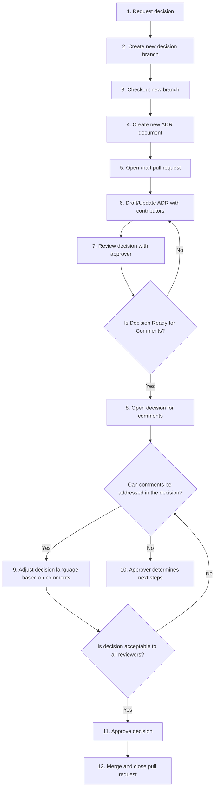
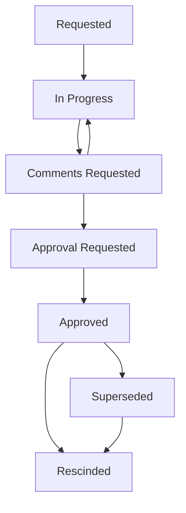

# Decision Log

This repository is the source of truth for technical decisions related to the architecture described by this organizer.  The decisions are authored as [Markdown](https://docs.github.com/en/get-started/writing-on-github/getting-started-with-writing-and-formatting-on-github/basic-writing-and-formatting-syntax) files using [adr-tools](https://github.com/npryce/adr-tools).

## Default Approver

The approver for this repository is [Tim Spaulding](https://github.com/tspauld98) unless he delegates the responsibility.

## Current Decisions

The following decisions have been approved and are in effect:

| Serial Number | Driver        | Title                                                                             |
| ------------- | ------------- | --------------------------------------------------------------------------------- |
| 0001          | Tim Spaulding | [Record Architecture Decisions](/decisions/0001-record-architecture-decisions.md) |
| 0002          | Tim Spaulding | [First Principles](/decisions/0002-first-principles.md)                           |
| 0003          | Tim Spaulding | [Technology Stack](/decisions/0003-technology-stack.md)                           |
| 0004          | Tim Spaulding | [Initial Release](/decisions/0004-initial-release.md)                             |

## Superseded and Rescinded Decisions

The following decisions have been superseded or rescinded and are no longer in effect:

| Serial Number | Status        | Title                                                                             |
| ------------- | ------------- | --------------------------------------------------------------------------------- |
| None          | N/A           | N/A                                                                               |

## Getting Started

### Pre-requisites

To author decisions, you will need to install [adr-tools](https://github.com/npryce/adr-tools) on your local machine.  This toolset will help you create new ADR documents ensuring they are in the correct location and using the correct template.

In addition to `adr-tools`, since these decisions are tracked in a Git repository, you will need to have `git` installed on your local machine and the local repository on your machine should be synced with an `origin` repository on Github.

### Requesting a Decision

To request a decision, [create an issue](https://github.com/tspauld98/arch-organizer-template/issues/new) for this repository on Github with the following information:

* Title: A short title for the decision
* Description: A detailed description of the requested decision with the following information:
  * Context: The issue motivating the decision, and any context that influences or constrains the decision.
  * Scope: The scope of the requested decision (i.e. specific component, service-wide or organization-wide).
  * Type: The type of the requested decision (i.e. Technology Selection or Process Change).
* Labels: Add the `Requested` label to the issue to distinguish it from a normal change request.

### Authoring a Decision

The basic process for authoring a decision is illustrated in the following diagram:

 

 

Here is more detail for each step in the process:

1. **Request decision** (OPTIONAL): Create an issue in the repository to request a new decision.
2. **Create new decision branch**: Create a new branch in the repository to author the decision.
3. **Checkout new branch**: Checkout the new branch on your local machine.
4. **Create new ADR document**: Use `adr-tools` to create a new ADR document in the correct location with the correct template using the `adr new` command.  Commit the new ADR document to the new branch and push the branch to the origin repository.
5. **Open draft pull request**: Open a new draft pull request for the new branch to begin the collaboration process.
6. **Draft/Update ADR with contributors**: Work with other contributors to draft and update the ADR document with the necessary information to complete the decision.
7. **Review decision with approver**: Review the decision with the approver to ensure it is ready for comments.
8. **Open decision for comments**: Open the decision for comments by adding the `Comments Requested` label to the pull request, taking the pull request out of draft mode, and notifying the stakeholders that the decision is ready for comments.
9. **Adjust decision language based on comments** (OPTIONAL): If comments are received during the prescribed comment period and they ***CAN*** be addressed by changing the decision, adjust the decision language based on the comments and review the decision with the approver to ensure it is address all feedback.
10. **Approver determines next steps** (OPTIONAL): If comments are received during the prescribed comment period and they ***CANNOT*** be addressed by changing the decision as it is currently formulated, the approver will determine the next steps.
11. **Approve decision**: Assuming all comments can be satisfactorly resolved and if the decision is acceptable to all reviewers, approve the decision by adding the `Approved` label to the pull request.
12. **Merge and close pull request**: The approver merges the pull request into the main branch and close the pull request.

### Contributing to a Decision

As a contributor, your responsibility is to work with the decision author to draft and update the ADR document with the necessary information to complete the decision.  This may include providing feedback on the decision, suggesting changes to the decision, and reviewing the decision with stakeholders you know that might disagree with the decision.  These contributions take the form of **comments on the pull request** for the decision, **commits to the branch** for the decision, and/or a **formal pull request review** with comments aimed at specific parts of the decision.

### Reviewing a Decision

When you are either asked to review a decision or you self-assign yourself to review a decision, the proper methode for reviewing a decision is to use the **pull request review** feature in Github.  This feature allows you to comment on specific parts of the decision, suggest changes to the decision, and approve the decision when you are satisfied with the decision. By using the pull request review feature, it preserves the history of the decision as added context for future reviewers.

## Authoring Good Decisions

The key to authoring good decisions is to ensure that any dissent is raised early and addressed as completely as possible.  This means that the decision should be reviewed by all stakeholders that might disagree with the decision and that their feedback should be addressed in the decision.  This is the only way to ensure that the decision is made with the best information available and that it is made with the best interests of the organization in mind.  The **Context** section of the decision should be as lengthly as required to provide a new reader with all the information they need to understand the decision.  The **Decision** section should be as clear and concise as possible to ensure that the decision is easy to understand and easy to reference in the future.  The **Consequences** section should outline the impact of the decision and any implementation details that might be required to implement the decision.  In addition, if the decision has other implications, they should be outlined in this section as well.  Finally, it is vitally important that a formal decision process is not used as a means to block progress through passive disagreement.  Recognizing productive dissent versus unproductive dissent and enlisting the approver to help navigate the latter is crucial to formulated long-lasting formal decisions.

## Decision Lifecycle

The following diagram illustrates the lifecycle of a decision:

 

 

Decisions in the `Requested` and `In Progress` states are considered to be in draft mode and are not time-bound.  Decisions in the `Comments Requested` state are open for comments for a period of no more than 7 days.  Decisions in the `Approval Requested` state should not be open for approval for longer than 7 days.  Decisions in the `Approved` state are considered to be in effect and are not time-bound.  Decisions in the `Superseded` and `Rescinded` states are considered to be no longer in effect and are not considered to be current.
