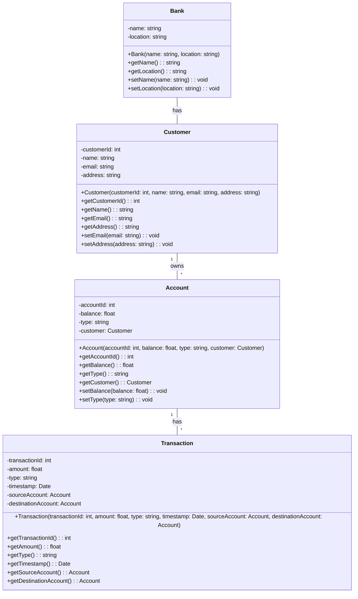

# Domain Object Model

## Purpose

The purpose of domain object model is to describe the classes and relationships in the system that model real-world entities and their relationships.  The class diagrams are intended to describe in detail the bounded context of the target-state solution to provide additional clarity on the system's primary structures and their interactions for developers.  The artifacts in the domain object model are at the `sea` level of abstraction.

## Electivity

This section is considered:  **Optional**

## Domain Object Model for Online Banking

The class diagram below shows the structure of the domain objects for the online banking system.

 

 

