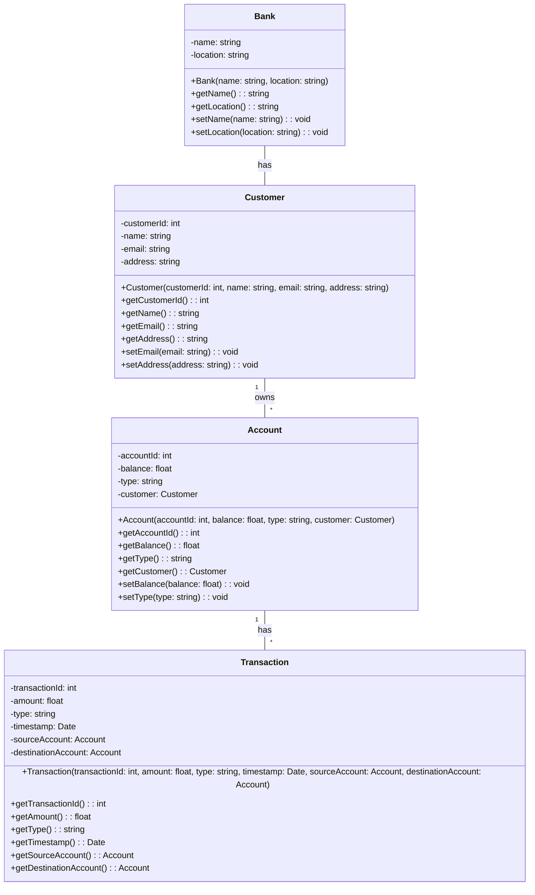

# Class Diagrams

## Purpose

The purpose of class diagrams is to describe the structure of the system by illustrating the classes and their relationships.  The class diagrams are intended to describe in detail the structure of the target-state solution to provide additional clarity on the system's components and their interactions for developers.  The artifacts in the class diagrams are at the `fish` level of abstraction.

## Electivity

This section is considered:  **Optional**

## Domain Object Model for Online Banking

The class diagram below shows the structure of the domain objects for the online banking system.

 

 

## More Information on Class Diagrams

While class diagrams can be critical to understand how a system works, they are often not necessary for every system.  The decision to include class diagrams should be based on the complexity of the system and the need to understand the structure of the system by developers.  If the system is simple and the structure is obvious, then class diagrams may not be necessary.  For more information on class diagrams, see the [UML Class Diagrams](https://www.uml-diagrams.org/class-diagrams-overview.html) page.  Both Mermaid and Lucidchart support class diagrams.
