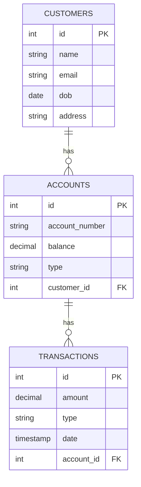

# Data Models

## Purpose

The purpose of the data models is to describe the data structures and relationships that are used by the system.  The data models are intended to specify the structure of the data stores for developers and database administrators.  The artifacts in the data models are at the `fish` level of abstraction.

## Electivity

This section is considered:  **Mandatory, if Detailed View is included**

## Online Banking Data Model

The data model below shows the structure of the database for the online banking system.

### Online Banking Entity Relationship Diagram

 

 

