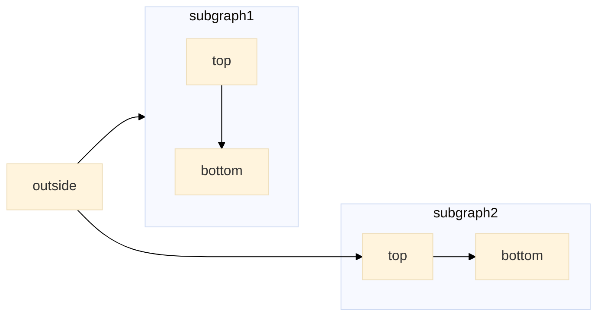
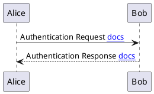
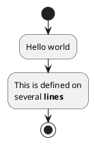

# Examples

This page contains examples of the different types of content that can be added to your documentation using some of the plugins that are included with this template.  You can find more information about the plugins included with this template [here](https://github.com/tspauld98/basic-docsify-gh-template).

## Tabbed Content Example

<!-- tabs:start -->

### **First Tab**

This is the first tab content. Lorem ipsum dolor sit amet, consectetur adipiscing elit, sed do eiusmod tempor incididunt ut labore et dolore magna aliqua. Ut enim ad minim veniam, quis nostrud exercitation ullamco laboris nisi ut aliquip ex ea commodo consequat. Duis aute irure dolor in reprehenderit in voluptate velit esse cillum dolore eu fugiat nulla pariatur. Excepteur sint occaecat cupidatat non proident, sunt in culpa qui officia deserunt mollit anim id est laborum.

### **Second Tab**

This is the second tab content. Lorem ipsum dolor sit amet, consectetur adipiscing elit, sed do eiusmod tempor incididunt ut labore et dolore magna aliqua. Ut enim ad minim veniam, quis nostrud exercitation ullamco laboris nisi ut aliquip ex ea commodo consequat. Duis aute irure dolor in reprehenderit in voluptate velit esse cillum dolore eu fugiat nulla pariatur. Excepteur sint occaecat cupidatat non proident, sunt in culpa qui officia deserunt mollit anim id est laborum.

### **Third Tab**

This is the third tab content. Lorem ipsum dolor sit amet, consectetur adipiscing elit, sed do eiusmod tempor incididunt ut labore et dolore magna aliqua. Ut enim ad minim veniam, quis nostrud exercitation ullamco laboris nisi ut aliquip ex ea commodo consequat. Duis aute irure dolor in reprehenderit in voluptate velit esse cillum dolore eu fugiat nulla pariatur. Excepteur sint occaecat cupidatat non proident, sunt in culpa qui officia deserunt mollit anim id est laborum.

<!-- tabs:end -->

## Code Block Example

```javascript
// This is a comment
var x = 1;
```

## Mermaid Diagram Examples

***You can find more information about all the Mermaid diagrams supported [here](https://mermaid.js.org/intro/).***



## PlantUML Diagram Examples

***You can find more information about all the PlantUML diagrams supported [here](https://plantuml.com/).***




