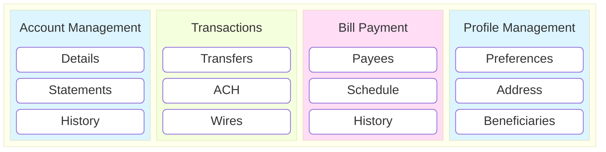

# Capability Map

## Purpose

A capability map, sometimes referred to as a feature map or city map, is a diagram that shows the current and future capabilities of the system. The capabilities are decomposed as a layer or block diagram where the outermost container is the problem domain and the innermost blocks are lower-level features. The capabilities in a capability map help decompose the problem domain into manageable pieces that can be developed and delivered incrementally priortized by business value.

## Electivity

This artifact is considered:  **Mandatory**

## Online Banking Capability Map

In addition to the illustration below, occasionally a textual description or inventory of the capability map is useful especially when the capabilities are not self-explanatory.

The latest version of Mermaid provides block diagrams that can be used to create capability maps.  The diagram below is an example of a capability map for an online banking system done with Mermaid.

 

 

