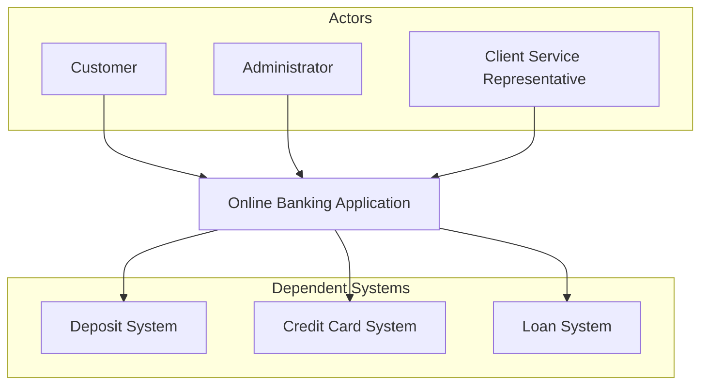

# Context Diagram

## Purpose

The context diagram is a high-level diagram that provides an overview of the system and its environment, showing all the entities that interact with the system. It is a good starting point for understanding the system and its environment.

The context diagram is a simple diagram that shows the system as a single entity and all the entities that interact with the system. The system is represented in the middle of the diagram, and the entities that interact with the system are represented either above or below the system entity. The system and the entities are connected by lines that represent the interactions between them.

## Electivity

This section is considered:  **Mandatory**

## System Context Diagram

In addition to the illustration below, occasionally a textual description of the context diagram is useful especially entities such as the `Actors` or `Dependent Systems` are not self-explanatory.

