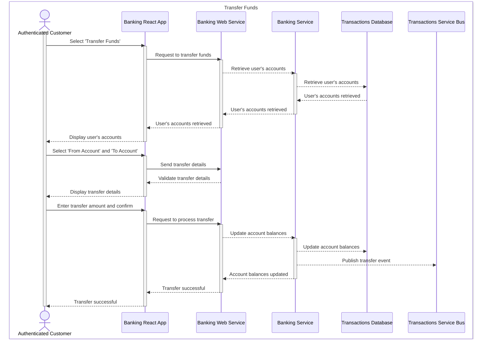

# Representative Sequence Diagrams

## Purpose

The representative sequence diagrams are a set of diagrams that shows the interactions between the system components of the target-state solution.  These diagrams are used to demonstrate how the key use cases exercise the functionality of the target-state solution. The representative sequence diagrams are intended to illustrate the behavior of the target-state solutions for business stakeholders and technical leadership.  The artifacts in the representative sequence diagrams are at the `kite` level of abstraction.

## Electivity

This artifact is considered:  **Optional**

## Representative Sequence Diagrams for Online Banking System

Usually, there is at least one representative sequence diagram for each key use case.  The diagram below shows the interactions between the system components for the `Transfer Funds` use case.

### UC-03: Transfer Funds Sequence Diagram

 

 

