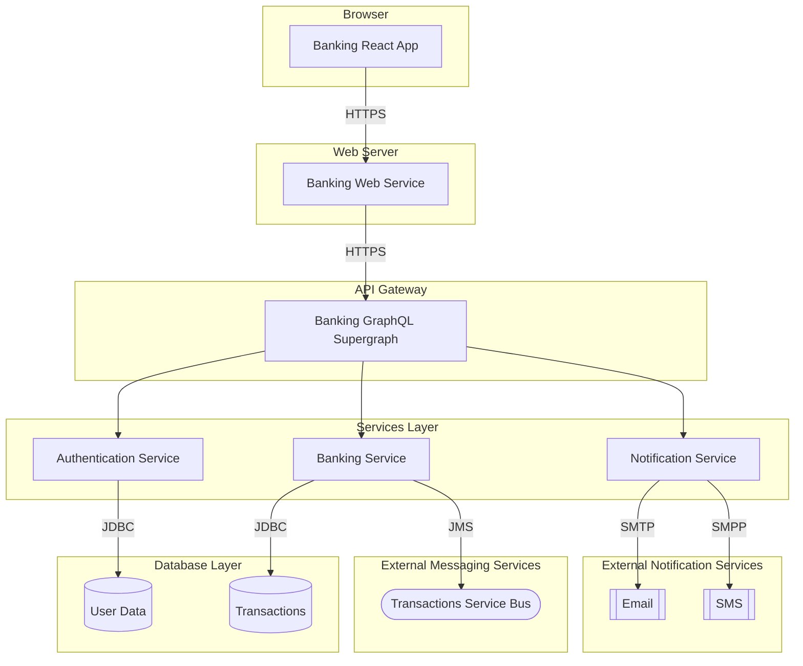

# Target-State Solution

## Purpose

The target-state solution is a diagram that illustrates and describes the desired state of the solution required to solve the business problem as described by stakeholders.  It is a high-level diagram that shows the primary system components of the solution and the environment in which it runs including any technical dependencies required at run-time.  The target-state solution is intended to brief business stakeholders and technical leadership on what components need to be built to deliver the solution.  The artifacts in the target-state solution are at the `kite` level of abstraction.

## Electivity

This artifact is considered:  **Mandatory**

## Target-State Solution Diagram

In addition to the illustration below, occasionally a textual description of the components that compose the target-state solution is useful especially when the components are not self-explanatory.

 

 

